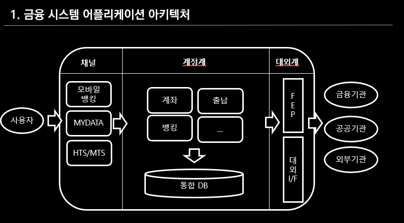
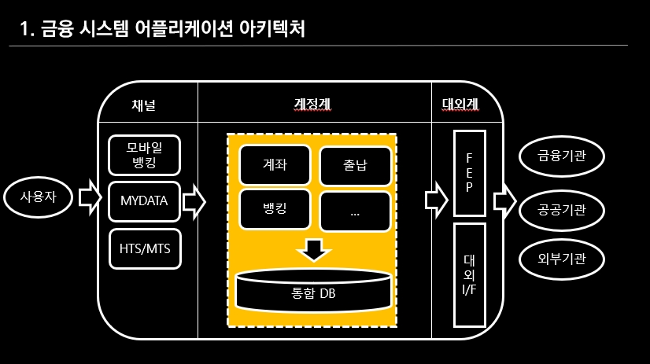
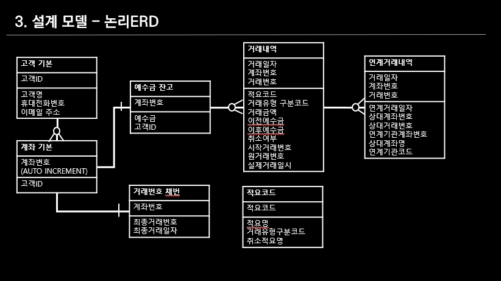
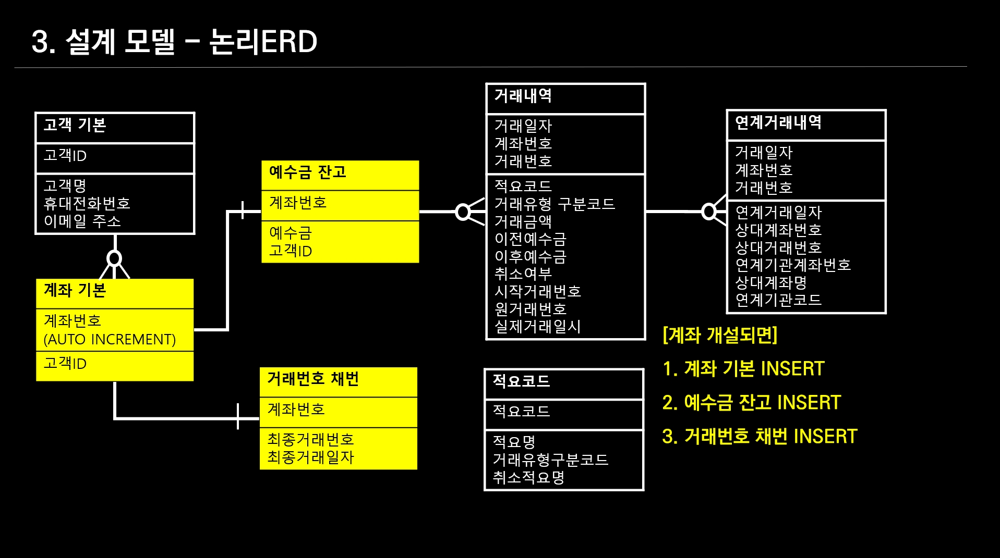
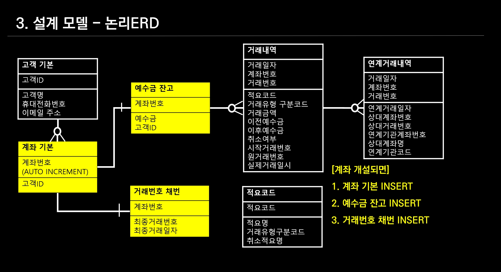
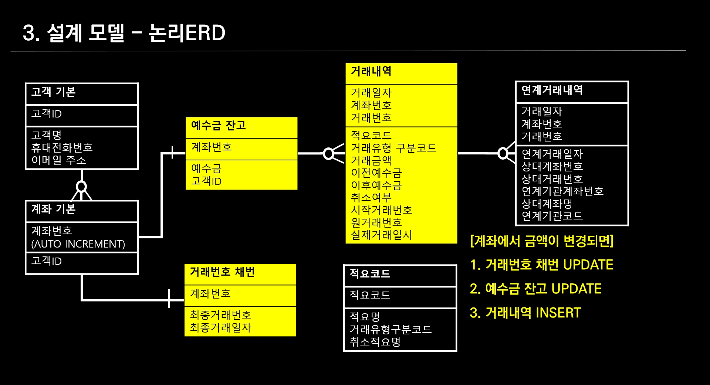
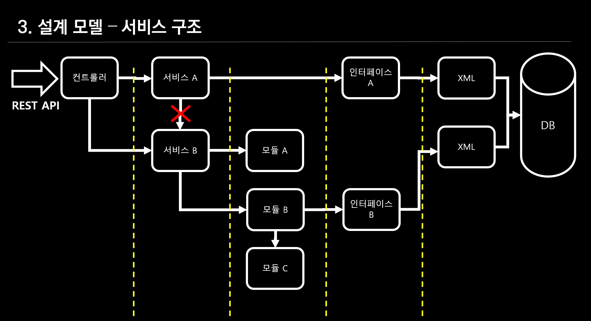

# Simple Bank
## 쉽고 간단한 뱅킹 백엔드 시스템

제가 소개해드릴 내용은 오픈소스로 개발한 간단한 뱅킹 프로그램인데요.
요즘 스마트폰 앱들을 통해서 손쉽게 송금하고 있죠. 
저희가 여러 증권사 차세대 프로젝트를 수행하면서, 출납 뱅킹을 주로 개발 했거든요.
그래서 증권사 코어 프로그램인 뱅킹/출납 프로그램은 어떻게 되었을지 말씀드려볼까 합니다.

  
간단하게 그려본 금융 시스템 어플리케이션 아키텍처인 데요. 사용자는 스마트폰이나 pc를 통해서 금융 시스템을 사용하는데 이것을 채널이라고 부릅니다. 우리는 다양한 채널을 통해서 금융시스템에 접속해 잔고조회도 하고, 다른 계좌로 이체도 하는데요.
업무 프로세스와 관련 데이터를 관리하는 영역을 계정계 라고 하고, 보통 폐쇄망 안에 시스템을 구축하고 있습니다.
계정계 업무 영역은 계좌/출납/ 뱅킹 등 돈과 개설, 주문과 관련된 것으로 이뤄져 있으며, 통합 DB라는 오라클 DB를 사용하고 있습니다. 
이체와 같이 외부기관과 거래를 할 경우 대외계를 통해 전문을 주고 받게 됩니다.

  

저희는 앞에서 봤던 영역 중 심플한 뱅킹을 처리할 수 있도록 계정계 일부 영역을 개발했습니다.
화면에 노란색 박스가 칠해져 있는 부분 인데요.
오픈소스로 개발을 했고, REST API로 계좌개설, 잔고조회, 다른 계좌로 이체, 거래내역 조회 서비스를 구현했습니다.


테이블 논리 모델입니다.
고객 계좌에서 다른 계좌로 예수금을 이동하기 위해선 화면에 보이는 총 6가지 테이블이 필요합니다.

  
고객이 계좌를 개설 할 경우
1. 고객이 계좌 개설을 할 경우 계좌번호를 PK로 한 계좌번호 채번, 거래번호 채번, 예수금 잔고테이블에 레코드가 생성 됩니다.
계좌개설시 lock을 회피하기 위해 계좌번호는 AUTO INCREMENT를 적용했습니다.

이것을 보고 이런 질문이 있으실 것 같은데요.
**거래번호 채번테이블**은 왜 필요할까?
! 동시 다발적으로 거래가 발생하기 때문에 거래번호 채번 테이블로 락을 잡고, 테이블의 데이터로 PK로 거래내역 생성시 사용합니다.

  

고객계좌에서 예수금이 변동되는 거래라면
거래번호를 채번 테이블의 계좌의 최종거래번호와 최종거래일자를 UPDATE하고
예수금 잔고의 예수금을 변경시킵니다.
마지막으로 거래내역테이블에 앞서 채번한 거래번호와 예수금 변경내역을 기록합니다.

  
만약 다른계좌로 예수금을 송금하는 거래라면
예수금 변동과 상대계좌 정보를 기록하기위해 연계거래내역을 함께 생성 해 줍니다.

``` sql

-- 1. 데이터베이스 생성
  -- create database SB;
-- 2. 계정생성
  -- create user msa2022;
-- 3. 테이블 삭제 
drop table sb.CIA1000;
drop table sb.ACA0100;
drop table sb.RPD0100;  
drop table sb.RPA0100;
drop table sb.RPB1000;
drop table sb.RPD1000;
drop table sb.RPD1010;

-- 4. 테이블생성

/* 고객 기본- 회원가입할 때 생성- 정보계*/
CREATE TABLE SB.CIA1000(
  CUST_ID       VARCHAR(50)   NOT NULL comment '고객ID'
, CUST_NM       VARCHAR(50)            comment '고객명'
, HPNO          VARCHAR(11)            comment '휴대전화번호'
, EMAIL         VARCHAR(50)            comment '이메일주소'
, TR_ID         VARCHAR(8)             comment '거래ID'
, OPRT_TR_DTM   VARCHAR(16)            comment '조작거래일시'
, PRIMARY KEY (CUST_ID)
);

/*계좌 기본, 계좌원장으로 사용되면 계좌번호는 lock회피를 위해 SEQ로 사용*/
CREATE TABLE SB.ACA0100(
  ACNO          INT(10)        NOT NULL AUTO_INCREMENT PRIMARY KEY
, CUST_ID       VARCHAR(50)   NOT NULL comment '고객ID'
, TR_ID         VARCHAR(8)             comment '거래ID'
, OPRT_TR_DTM   VARCHAR(16)            comment '조작거래일시'
);

/*1.채번 - 계좌개설시 생성, 거래발생시 갱신*/
CREATE TABLE SB.RPD0100(
  ACNO         VARCHAR(11)   NOT NULL comment '계좌번호'
, LAST_TR_NO    INT(8)       NOT NULL comment '최종거래번호'
, LAST_TR_DT    VARCHAR(8)   NOT NULL comment '최종거래일자'
, TR_ID         VARCHAR(8)            comment '거래ID'
, OPRT_TR_DTM  VARCHAR(16)            comment '조작거래일시'
, PRIMARY KEY (ACNO)
);


/*2.적요코드 - 공통코드*/
CREATE TABLE SB.RPA0100(
  SYNS_CD       VARCHAR(3) NOT NULL comment '적요코드'
, SYNS_NM       VARCHAR(20)         comment '적요명'
, TR_TP_DCD     VARCHAR(2)          comment '거래유형구분코드'
, CNCL_SYNS_NM  VARCHAR(20)         comment '취소적요명'
, TR_ID         VARCHAR(8)          comment '거래ID'
, OPRT_TR_DTM   VARCHAR(16)         comment '조작거래일시'
, PRIMARY KEY (SYNS_CD)
);

/*3.예수금잔고 - 계좌개설시 생성, 거래발생시 갱신*/
CREATE TABLE SB.RPB1000(
  ACNO          VARCHAR(11)  NOT NULL comment '계좌번호'
, DACA          BIGINT(18)            comment '예수금'
, CUST_ID       VARCHAR(50)           comment '고객ID'
, TR_ID         VARCHAR(8)            comment '거래ID'
, OPRT_TR_DTM   VARCHAR(16)           comment '조작거래일시'
, PRIMARY KEY  (ACNO)
);

/*4.거래내역 - 거래발생시 갱신*/
CREATE TABLE SB.RPD1000(
  TR_DT        VARCHAR(8) NOT NULL  comment '거래일자'
, ACNO         VARCHAR(11) NOT NULL comment '계좌번호'
, TR_NO        INT(8) NOT NULL      comment '거래번호'
, SYNS_CD      VARCHAR(3)           comment '적요코드'
, TR_TP_DCD    VARCHAR(2)           comment '거래유형구분코드'
, TR_AMT       BIGINT(18)           comment '거래금액'
, BF_DACA      BIGINT(18)           comment '이전예수금'
, AF_DACA      BIGINT(18)           comment '이후예수금'
, CNCL_YN      VARCHAR(1) NOT NULL  comment '취소여부'
, STRT_TR_NO   INT                  comment '시작거래번호'
, ORGN_TR_NO   INT                  comment '원거래번호'
, CLNT_NM      VARCHAR(50)          comment '의뢰인명'
, REAL_TR_DTM  DATE                 comment '실제거래일시'
, TR_ID         VARCHAR(8)          comment '거래ID'
, OPRT_TR_DTM  VARCHAR(16)          comment '조작거래일시'
, PRIMARY KEY (TR_DT,ACNO,TR_NO)
);

/*5.연계거래내역 -  당행/타행 거래발생시 갱신*/
CREATE TABLE SB.RPD1010(
  TR_DT            VARCHAR(11) NOT NULL comment '거래일자'
, ACNO             VARCHAR(11) NOT NULL comment '계좌번호'
, TR_NO            INT(8)     NOT NULL  comment '거래번호'
, REL_TR_DT        VARCHAR(8)           comment '연계거래일자'
, OPNT_ACNO        VARCHAR(11)          comment '상대계좌번호'
, OPNT_TR_NO       INT(8)               comment '상대거래번호'
, REL_COM_ACTNO    VARCHAR(20)          comment '연계기관계좌번호'
, OPNT_ACT_NM      VARCHAR(50)          comment '상대계좌명'
, REL_COM_CD       VARCHAR(10)          comment '연계기관코드'
, TR_ID            VARCHAR(8)           comment '거래ID'
, OPRT_TR_DTM      VARCHAR(16)          comment '조작거래일시'
, PRIMARY KEY (TR_DT,ACNO,TR_NO)
);

INSERT INTO SB.RPA0100 ( SYNS_CD, SYNS_NM , TR_TP_DCD , CNCL_SYNS_NM , OPRT_TR_DTM) VALUES ('001', '입금', '01', '입금취소', DATE_FORMAT(SYSDATE(),'%Y%m%d%H%i%s'));
INSERT INTO SB.RPA0100 ( SYNS_CD, SYNS_NM , TR_TP_DCD , CNCL_SYNS_NM , OPRT_TR_DTM) VALUES ('002', '출금', '02', '출금취소', DATE_FORMAT(SYSDATE(),'%Y%m%d%H%i%s'));
INSERT INTO SB.RPA0100 ( SYNS_CD, SYNS_NM , TR_TP_DCD , CNCL_SYNS_NM , OPRT_TR_DTM) VALUES ('003', '대체입금', '01', '대체입금취소', DATE_FORMAT(SYSDATE(),'%Y%m%d%H%i%s'));
INSERT INTO SB.RPA0100 ( SYNS_CD, SYNS_NM , TR_TP_DCD , CNCL_SYNS_NM , OPRT_TR_DTM) VALUES ('004', '대체출금', '02', '대체출금취소', DATE_FORMAT(SYSDATE(),'%Y%m%d%H%i%s'));

/*데이터베이스 사용*/
USE SB;
```

## 02.3 과제 biz설계
### 02.3.1 계좌 개설
* 계좌번호 채번과 거래번호 채번 예수금 잔고 테이블에 INSERT가 된다.
* 계좌번호는 SEQ를 사용한다- 그래야 계좌개설 업무에 LOCK이 발생하지 않는다.
  * 대부분의 증권사는 연번이다. ( 토스뱅크, 카카오페이증권은 SEQ)

### 02.3.2 입금 출금 이체/대체
* 거래번호 채번을 한다. (일자,계좌로 MAX+1)
  * `테이블 lock을 잡는다`.- 잔고의 변동 채번으로 막는다.
* 예수금을 잔고를 변경한다.
* 거래내역을 생성한다.
  * 적요코드를 넣는다.- 일별집계와 회계처리시 적요코드 별로 계정집계를 한다.
* 이체또는 대체 거래는 연계거래내역을 생성한다.
  * 상대계좌가 당사면 출금, 입금 계좌 모두 생성하고
  * 상대계좌고 타사면 출금 계좌만 생선한다.
  
### 02.3.3 잔고 조회
* 고객별 잔고는 예수금잔고 테이블의 고객id로 group by 해서 조회
* 계좌별 잔고는 계좌기준으로 예수금잔고 테이블 조회

### 02.3.4 거래내역 조회
* 계좌와 기간을 입력값으로 받아서, 조회 한다.

## 03 개발 

### 03.1 개발 환경

- 프레임워크: STS4, myBatis
- DB: mariaDB
- 언어: JAVA, SQL
- OS: Window
- 테스트: swagger  - 스프링부트 버전을 2.5.2로 낮춰야 사용가능 했음.(버전 호환성-VERSION HELL)

### 03.2 개발 표준 ###

### 03.2.1 서비스 구조
  

- 컨트롤러
  - REST API로 제공할 서비스를 등록  
  
- 서비스
  - 서비스에서 서비스는 호출 할 수 없다.
  - 인터페이스를 통해 XML을 호출 할 수 있다.  
  - 공통 모듈을 조합해 업무를 설계할 수 있다.
- VO
  - 컨트롤러에서 서비스, 서비스에서 인터페이스, 서비스에서 모듈간 데이터를 주고받을 데이터르 정의해둠
- 인터페이스
  - @Mapper 어노테이션을 사용해 xml에서 구현한 sql한다.
- 모듈
  - 타 서비스에서도 사용할 수 있는 기능은 모듈로 분리
  - 모듈에서 모듈 호출이 가능하다.
  - 인터페이스를 호출할 수 있다.
- XML
  - 인터페이스에서 정의한 메소드를 구현한다.